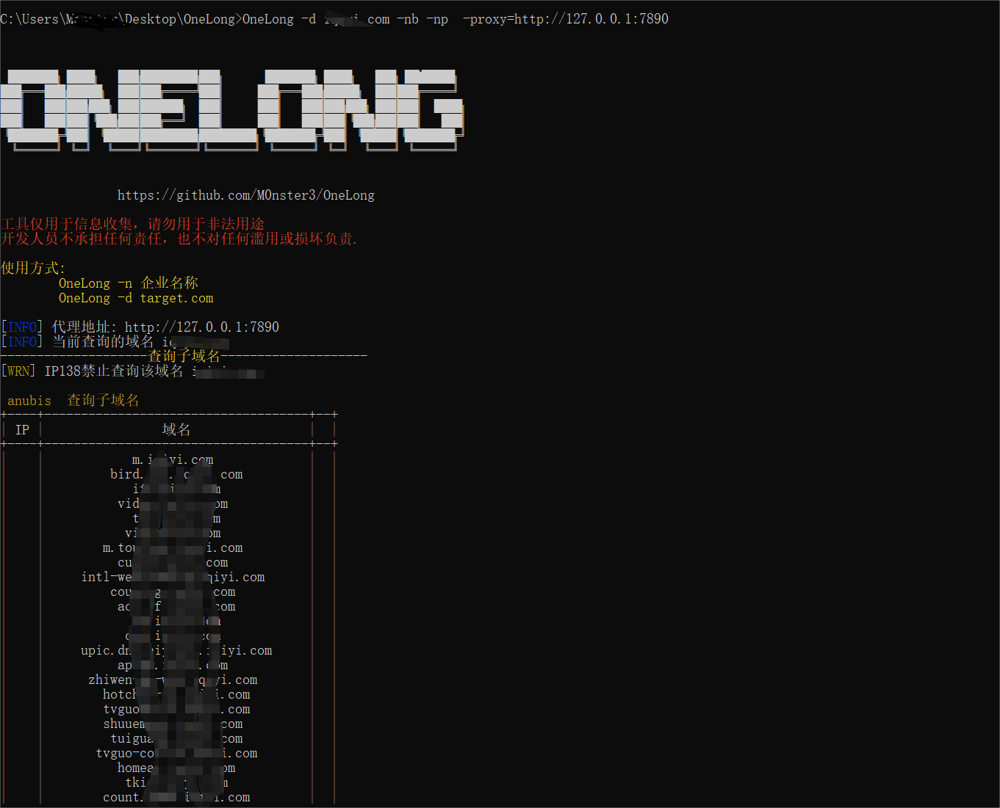

# OneLong


郑重声明：文中所涉及的技术、思路和工具仅供以安全为目的的学习交流使用，任何人不得将其用于非法用途以及盈利等目的，否则后果自行承担。

## 0x01、介绍

作者：[Monster3](https://github.com/M0nster3)

定位：为了简化前期信息收集的繁重任务，协助红队人员快速的信息收集，测绘目标资产，寻找薄弱点，暂时实现了收集企业信息，子域名收集，子域名爆破，资产邮箱，指纹探测，漏洞扫描，后台识别，后续会跟新对IP相关的搜集。

## 0x02、使用

使用方式比较简单，现在主要针对不同需求实现了两种信息收集的方式，一种是根据企业关键字去进行信息搜集，这里需要填写aqc和qcc的API，第二种方式是需要填写公司域名，去进行搜集

注意：在调用API的时候有些需要科学上网，最好在进行使用的时候加上-proxy=http://127.0.0.1:7897 进行科学上网。

1、根据企业关键字去进行信息搜集，最后填写正确完整的关键字，这部分主要参考了[ENScan_GO](https://github.com/wgpsec/ENScan_GO),相关搜索企业细节以及方法和它是一样

- OneLong -n 企业名称 -proxy=http://127.0.0.1:7890

2、根据企业域名去进行信息搜集

- OneLong -d target.com -proxy=http://127.0.0.1:7890

3、如果目标企业存在安全设备，并且IP资源不多的话，可以只进行被动探测

- OneLong -d target.com/-n 企业名称 -nb -np -proxy=http://127.0.0.1:7890


```
  -d string
        域名
  -deep int
        递归搜索n层公司 (default 5)
  -delay int
        填写最大延迟时间（秒）将会在1-n间随机延迟
  -invest float
        投资比例  (default 70)
  -is-branch
        深度查询分支机构信息（数量巨大），默认不查询
  -n string
        企业关键词 eg 百度
  -nb
        不进行爆破子域名
  -np
        不进行漏洞扫描
  -o string
        结果输出的文件夹位置(可选)
  -proxy string
        设置代理例如:-proxy=http://127.0.0.1:7897
  -timeout int
        每个请求默认1（分钟）超时 (default 1)
```


## 0x03、相关配置文件解读

### 子域名相关配置文件

想要搜集的信息更加全面，可以添加相应的API，添加的API不含直接收费的，都是一些免费的和一些有免费次数的

[binaryedge](https://app.binaryedge.io/account/api) , [fullhunt](https://fullhunt.io/user/settings/) , [qaxhunter](https://hunter.qianxin.com/home/myInfo) , [bevigil](https://bevigil.com/osint/api-keys) , [CensysToken/CensysSecret](https://search.censys.io/account/api) , [zomeye](https://www.zoomeye.org/profile) , [whoisxmlapi](https://user.whoisxmlapi.com/products)  , [virustotal](https://www.virustotal.com/gui/user/M0nster3/apikey) , [shodan](https://account.shodan.io/) , [chaos](https://chaos.projectdiscovery.io/#/) , [leakix](https://leakix.net/settings/api) , [netlax](https://app.netlas.io/profile/) , [quake](https://quake.360.net/quake/#/personal?tab=message) , [googleid]( https://developers.google.com/custom-search/v1/overview#search_engine_id)  , [googleapi](https://developers.google.com/custom-search/v1/overview#api_key) , [fofakey/fofaEmail](https://fofa.info/userInfo) , [githubtoken](https://github.com/settings/tokens) , 

[securitytrails](https://securitytrails.com/app/auth/login?return=/app/account):这个需要企业邮箱注册，可以去网上找一个免费注册一些比如[网易](https://mailh.qiye.163.com/) , 

[racent](https://www.racent.com/):抓包获取数据包里面的token

[Aiqicha](https://aiqicha.baidu.com/)：Cookie信息请勿直接 `document.cookie`，可能因为http-only 选项无法复制全导致登陆失败


[阿拉丁](https://www.aldzs.com/):点击任意请求，拿到请求里的TOKEN


[TYC tycid](https://www.tianyancha.com/):配置COOKIE后配置tycid,这里的cookie也是个Aiqicha一样那样直接从数据包中获取

[Qimai](https://www.qimai.cn/):登陆账号然后把数据包里面的PHPSESSID提取出来就可以，这个也是点击任意链接都可以


### [MassDns模块](https://github.com/blechschmidt/massdns)

注意：Releases中的文件夹名称不能更换

工具中的爆破主要是引用了MassDns爆破工具，作者称无需特殊配置，MassDNS 就能够使用公开可用的解析器每秒解析超过 350,000 个名称。是一个高效的爆破工具，

- resolvers: Releases中有一个Script/MassDns/resolvers.txt文件夹名称添加进去，如果更换了resolvers.txt,必须放在当前文件夹只需要把名称换了即可

- wordlist：爆破的目录文件，项目中的爆破文件都在这个目录下Script\Dict，

- massdnsPath:将Script/MassDns下的MassDns应用程序名称添加进来，如果是Linux的则需要把MassDns.exe改为相应的名称

### [Afrog](https://github.com/zan8in/afrog)

#### ceye

- 访问[ceye.io](http://ceye.io/)网站并注册一个帐户。
- 登录并进入个人设置页面。
- 复制`domain`和`api-key`并在文件中正确配置它们。

#### Dnslogcn

- 无需配置，但 [dnslog.cn不稳定](http://dnslog.cn/)


#### Alphalog

- 需要构建服务 [alphalog](https://github.com/AlphabugX/Alphalog)


#### Xray

- 需要搭建 [xray服务](https://docs.xray.cool/tools/xray/advanced/reverse)


### 相关目录介绍

目前是有四种目录，
AfrogAddPoc:这个目录主要是里面如果添加一些Afrog工具的一些自动POC,可以放到这个文件夹，工具会自动识别

Dict：这个里面现在是放了两个文件一个是Login.txt 这个主要就是在进行查找后台路径的时候，对路径的一些匹配，另一个是一个子域名目录文件，在进行MassDns爆破的时候加载的字典。

Ehole：这和里面主要放的是在进行url访问，进行一些高危漏洞以及CMS进行指纹识别的规则。

MassDns：这个里面主要就是放MassDns进行爆破的应用程序和所需要的resolvers文件。


```
Utils:
  output: ""            # 导出文件位置
cookies:
  aiqicha: ''           # 爱企查   Cookie
  tianyancha: ''        # 天眼查   Cookie
  tycid: ''        		# 天眼查   CApi ID(capi.tianyancha.com)
  aldzs: ''             # 阿拉丁   TOKEN(see README)
  qimai: ''             # 七麦数据  Cookie
  binaryedge: ''		# binaryedge  Cookie 免费查询250次
  fullhunt: ''			# Fullhunt Cookie 威胁平台 每月免费100次
  hunter: ''			# Hunter Cookie 威胁平台 每日免费500个数据
  bevigil: ''           # Bevigil Cookie 威胁平台 每月免费50次
  CensysToken: ''       # Censys Token 威胁平台 每月免费250次
  CensysSecret: ''      # Censys Secret 威胁平台 每月免费250次
  zoomeye: ''			# ZooEye Cookie 每月1000条
  whoisxmlapi: ''		# whoisxmlapi Cookie 免费500次
  virustotal: ''        # virustotal Cookie 每分钟4次 每天500次
  shodan: ''			# shodan Cookie 
  chaos: ''				# chaos Key
  leakix: ''			# leakix Key
  netlas: ''			# Netlas key
  quake: ''				# Quake key
  securitytrails: ''	# securitytrails 需要企业邮箱，每个月50次
  googleid: ''			# google id 免费的API只能查询前100条结果,每天免费提供 100 次搜索查询
  googleapi: ''			# google Api 免费的API只能查询前100条结果,每天免费提供 100 次搜索查询
  fofaKey: ''			# Fofa key
  fofaEmail: ''			# Fofa Email
  githubtoken: ''		# Github Token 
  racent: ''			# racent Token
massdns:
  resolvers: 'resolvers.txt'			# resolvers 文件名称
  wordlist: 'names.txt'			# 子域名爆破文件名称
  massdnsPath: 'massdns.exe'		# Massdns工具名称
email:
  emailhunter: ''		# Email hunter Token
  intelxEmail: ''		# Email Intelx Token
  tombaKey: ''			# Email tombaKey
  tombaSecret: ''		# Email tombaSecret
#Afrog配置
reverse:
  alphalog:
    domain: ""
    api_url: ""
  ceye:
    api-key: ""
    domain: ""
  dnslogcn:
    domain: dnslog.cn
  eye:
    host: ""
    token: ""
    domain: ""
  jndi:
    jndi_address: ""
    ldap_port: ""
    api_port: ""
  xray:
    x_token: ""
    domain: ""
    api_url: http://x.x.x.x:8777

```

## 0x04、效果图




## 0x05、参考

[ENScan_GO](https://github.com/wgpsec/ENScan_GO)

[nemo_go](https://github.com/hanc00l/nemo_go)

[Oneforall](https://github.com/shmilylty/OneForAll)

[Shuize](https://github.com/0x727/ShuiZe_0x727)

[gau](https://github.com/lc/gau)

[subfinder](https://github.com/projectdiscovery/subfinder)
